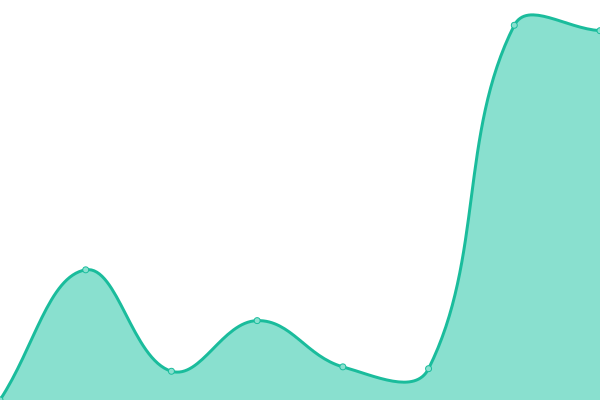

# [📈 Live Status](https://edoaurahman.github.io/check-web-uptime): <!--live status--> **🟧 Partial outage**

This repository contains the open-source uptime monitor and status page for [Ridho Aulia' Rahman](https://edoaurahman.github.io/check-web-uptime), powered by [Upptime](https://github.com/upptime/upptime).

With [Upptime](https://upptime.js.org), you can get your own unlimited and free uptime monitor and status page, powered entirely by a GitHub repository. We use [Issues](https://github.com/edoaurahman/check-web-uptime/issues) as incident reports, [Actions](https://github.com/edoaurahman/check-web-uptime/actions) as uptime monitors, and [Pages](https://edoaurahman.github.io/check-web-uptime) for the status page.

<!--start: status pages-->
<!-- This summary is generated by Upptime (https://github.com/upptime/upptime) -->
<!-- Do not edit this manually, your changes will be overwritten -->
<!-- prettier-ignore -->
| URL | Status | History | Response Time | Uptime |
| --- | ------ | ------- | ------------- | ------ |
|  [Gokuhost](https://gokuhost.com/) | 🟩 Up | [gokuhost.yml](https://github.com/edoaurahman/check-web-uptime/commits/HEAD/history/gokuhost.yml) | 

 4363ms
     
 | 

<a href="https://edoaurahman.github.io/check-web-uptime/history/gokuhost">100.00%</a>
    

|  [Siakad Polinema](http://siakad.polinema.ac.id/) | 🟥 Down | [siakad-polinema.yml](https://github.com/edoaurahman/check-web-uptime/commits/HEAD/history/siakad-polinema.yml) | 

 0ms
     
 | 

<a href="https://edoaurahman.github.io/check-web-uptime/history/siakad-polinema">100.00%</a>
    

|  [Lms Polinema](https://lmsslc.polinema.ac.id/) | 🟥 Down | [lms-polinema.yml](https://github.com/edoaurahman/check-web-uptime/commits/HEAD/history/lms-polinema.yml) | 

 0ms
     
 | 

<a href="https://edoaurahman.github.io/check-web-uptime/history/lms-polinema">100.00%</a>
    

|  [Edodev](https://edodev.my.id/) | 🟩 Up | [edodev.yml](https://github.com/edoaurahman/check-web-uptime/commits/HEAD/history/edodev.yml) | 

 10413ms
     
 | 

<a href="https://edoaurahman.github.io/check-web-uptime/history/edodev">99.14%</a>
    

<!--end: status pages-->

[**Visit our status website →**](https://edoaurahman.github.io/check-web-uptime)

## 📄 License

- Powered by: [Upptime](https://github.com/upptime/upptime)
- Code: [MIT](./LICENSE) © [Ridho Aulia' Rahman](https://edoaurahman.github.io/check-web-uptime)
- Data in the `./history` directory: [Open Database License](https://opendatacommons.org/licenses/odbl/1-0/)
